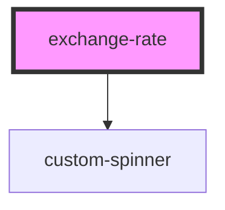

# exchange-rate

<!-- Auto Generated Below -->

## Events

| Event           | Description | Type                  |
| --------------- | ----------- | --------------------- |
| `emittedSymbol` |             | `CustomEvent<string>` |

## Dependencies

### Depends on

- [custom-spinner](../spinner)

### Graph

----------------------------------------------

*Built with [StencilJS](https://stenciljs.com/)*
